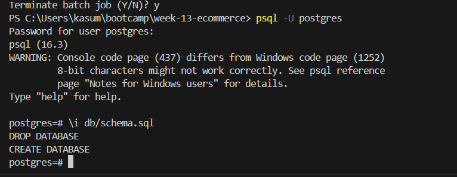
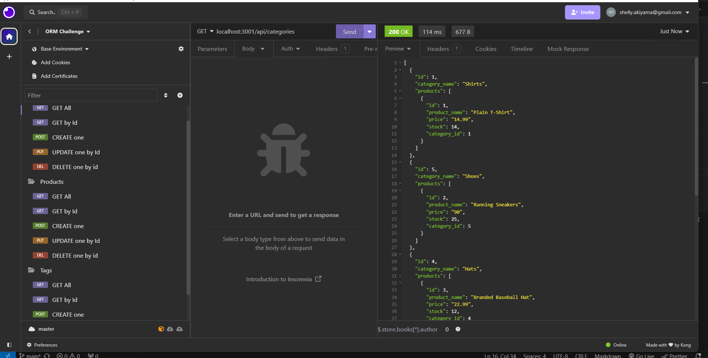
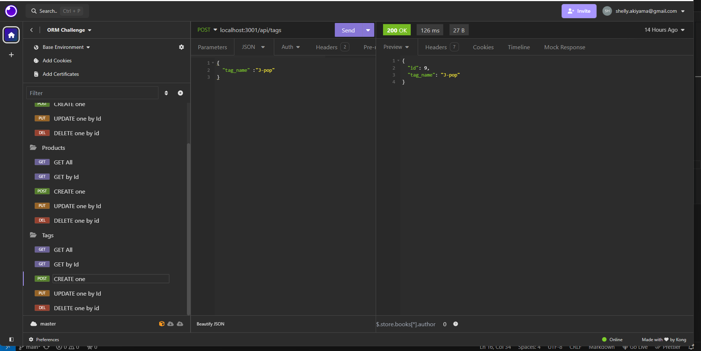

# e-commerce

## Description

- This project is the backend of e-commerce website using ORM.
- Using Postgre SQL to store the data, Sequelize for mapping the data under the models directory and routers.js under the routers/api fot sending/retrieving data via server
- Using Insomnia to check the request and response

## How to run

1. open the terminal and run npm install to install all necessary 
2. run psql -U postgres to start postgre SQL database (then type test as password)
3. \i db/schema.sql to create database
4. run npm run seed to seed data to the database
5. npm start
6. Use Insomnia to test the data 

## Usage

- Git repository URL:https://github.com/namahage1/e-commerce.git
- Video Demo URL: https://watch.screencastify.com/v/rtwtTJ4TyqBEXPryfI9D
-  get post put delete  https://app.screencastify.com/v3/watch/FH8YhdHKkJOgUNEz3rIq
-  UPDATE ALL 3 TABLES  https://app.screencastify.com/v3/watch/fImt1Lscenm7wkXQK9ON
    
 
 
 
 
 
    

